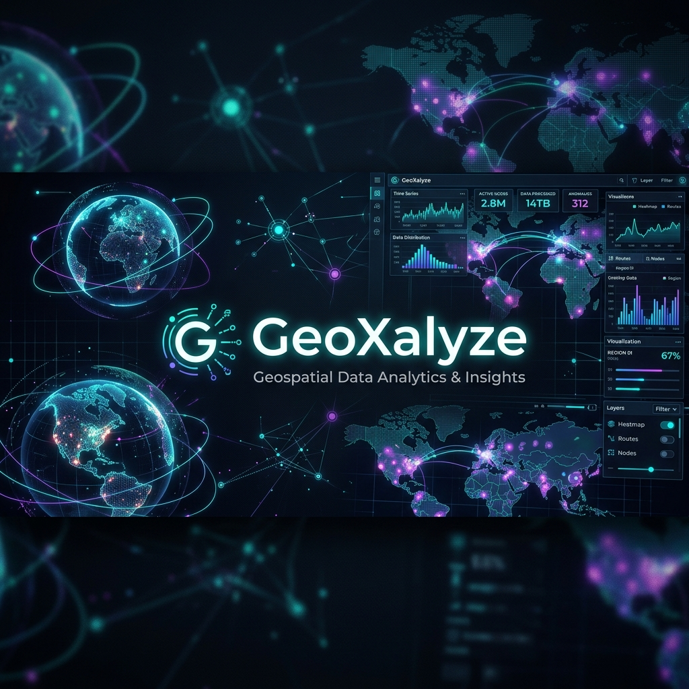
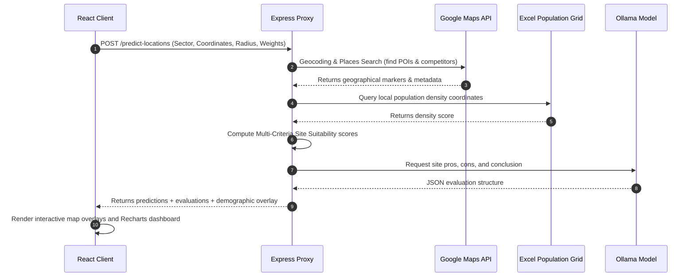

<div align="center">
  

  # 🗺️ GeoXalyze
  ### **Next-Gen Location Intelligence & Geospatial Suitability Engine**

  [](https://react.dev/)
  [](https://vite.dev/)
  [](https://tailwindcss.com/)
  [](https://nodejs.org/)
  [](https://developers.google.com/maps)
  [](https://ollama.com/)

  <p align="center">
    <strong>Empowering commercial real estate, EV expansion, and urban planning with multi-criteria spatial scoring.</strong>
  </p>

  ---
</div>

## 💡 Overview

**GeoXalyze** is a state-of-the-art **Location Intelligence & Site Suitability Engine** designed to solve complex site-selection decisions. By leveraging Google Maps APIs, customized demographic layers, and dynamic scoring algorithms, GeoXalyze identifies the top 5 most optimal locations in any selected area for critical sectors such as **EV Charging Stations**, **Retail Stores**, **Warehouses**, **Telecom Towers**, and **Renewable Energy Plants**.

---

## 🌟 Key Features

<div align="center">
  <table style="width:100%; border-collapse: collapse; border: none;">
    <tr>
      <td width="50%" style="border: 1px solid rgba(255,255,255,0.1); padding: 15px; border-radius: 8px; background: rgba(255,255,255,0.02); vertical-align: top;">
        <h3>🤖 AI-Weighted Scoring</h3>
        <p>Predicts the top 5 sites using multi-criteria weighted scoring (Footfall, Accessibility, Competition, Proximity, Power grids).</p>
      </td>
      <td width="50%" style="border: 1px solid rgba(255,255,255,0.1); padding: 15px; border-radius: 8px; background: rgba(255,255,255,0.02); vertical-align: top;">
        <h3>🗺️ High-Fidelity GIS Maps</h3>
        <p>Seamless integration with <code>@vis.gl/react-google-maps</code> supporting custom map styles (Satellite, Dark Mode, Hybrid, Roadmap).</p>
      </td>
    </tr>
    <tr>
      <td width="50%" style="border: 1px solid rgba(255,255,255,0.1); padding: 15px; border-radius: 8px; background: rgba(255,255,255,0.02); vertical-align: top;">
        <h3>🧠 LLM Site Summary Analyst</h3>
        <p>Integrates Ollama API to summarize generated location points, delivering instant Pros & Cons and a site feasibility verdict.</p>
      </td>
      <td width="50%" style="border: 1px solid rgba(255,255,255,0.1); padding: 15px; border-radius: 8px; background: rgba(255,255,255,0.02); vertical-align: top;">
        <h3>📄 PDF Readiness Reports</h3>
        <p>Generates detailed, printable site suitability certificates containing scores, charts, maps metrics, and coordinates.</p>
      </td>
    </tr>
  </table>
</div>

---

## 📐 System Architecture & Data Flow

GeoXalyze splits heavy mathematical workloads and GIS data fetches into a decoupled frontend-backend model:



---

## 🛠️ Tech Stack & Dependencies

| Category | Technologies |
| :--- | :--- |
| **Frontend** | React 19 • Vite • Tailwind CSS 3 • Lucide React |
| **Data Viz** | Recharts (dynamic weight/score visualizations) |
| **Mapping** | `@vis.gl/react-google-maps` (Google Maps JS API) |
| **Backend** | Node.js • Express 5 • CORS • Dotenv |
| **Data & AI** | Ollama LLM API • xlsx (SheetJS for Excel parsing) |
| **Reports** | jspdf • jspdf-autotable (PDF certificate generator) |

---

## 🚀 Getting Started

### 📋 Prerequisites
* **Node.js** (v18.x or higher)
* A **Google Maps API Key** (Maps JavaScript, Places, and Geocoding APIs enabled)

### 🛠️ Step-by-Step Installation

1. **Clone and Install Dependencies**
   ```bash
   npm install
   ```

2. **Configure Environment Variables**
   Create a `.env` file in the root directory:
   ```env
   VITE_GOOGLE_MAPS_API_KEY=YOUR_GOOGLE_MAPS_API_KEY_HERE
   OLLAMA_API_KEY=YOUR_OLLAMA_API_KEY
   ```
   > [!WARNING]
   > Keep your `.env` private. Never commit it to GitHub. It is ignored by git by default.

3. **Launch Development Servers**
   ```bash
   npm run dev
   ```
   * **Frontend Client:** [http://localhost:5173](http://localhost:5173)
   * **Backend API Proxy:** [http://localhost:3001](http://localhost:3001)

---

## 🧭 Use Cases & Sectors

<div align="center">
  <table style="width:100%; border-collapse: collapse; border: none;">
    <tr style="border: none;">
      <td style="border: none; padding: 10px; text-align: left;">
        <strong>⚡ EV Charging Stations</strong><br/>
        Places chargers in proximity to major highway intersections, shopping centers, and existing parking, while tracking local grid readiness.
      </td>
    </tr>
    <tr style="border: none;">
      <td style="border: none; padding: 10px; text-align: left;">
        <strong>🛒 Retail & Hospitality</strong><br/>
        Pinpoints high-traffic urban areas, filters out direct competitors, and targets clusters with maximum purchasing power.
      </td>
    </tr>
    <tr style="border: none;">
      <td style="border: none; padding: 10px; text-align: left;">
        <strong>📦 Warehouses & Logistical Hubs</strong><br/>
        Maximizes accessibility for delivery fleets, prioritizing close connections to main freeways and freight nodes.
      </td>
    </tr>
    <tr style="border: none;">
      <td style="border: none; padding: 10px; text-align: left;">
        <strong>🗼 Telecom & 5G Infrastructure</strong><br/>
        Computes optimal cellular tower placement to prevent coverage overlaps and optimize signal propagation.
      </td>
    </tr>
    <tr style="border: none;">
      <td style="border: none; padding: 10px; text-align: left;">
        <strong>☀️ Renewable Energy Plants</strong><br/>
        Evaluates environmental factors, area constraints, and grid connectivity.
      </td>
    </tr>
  </table>
</div>

---

### 📱 App UI Preview
<p align="center">
  
</p>
